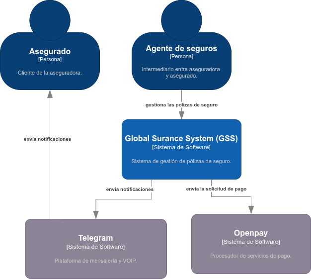
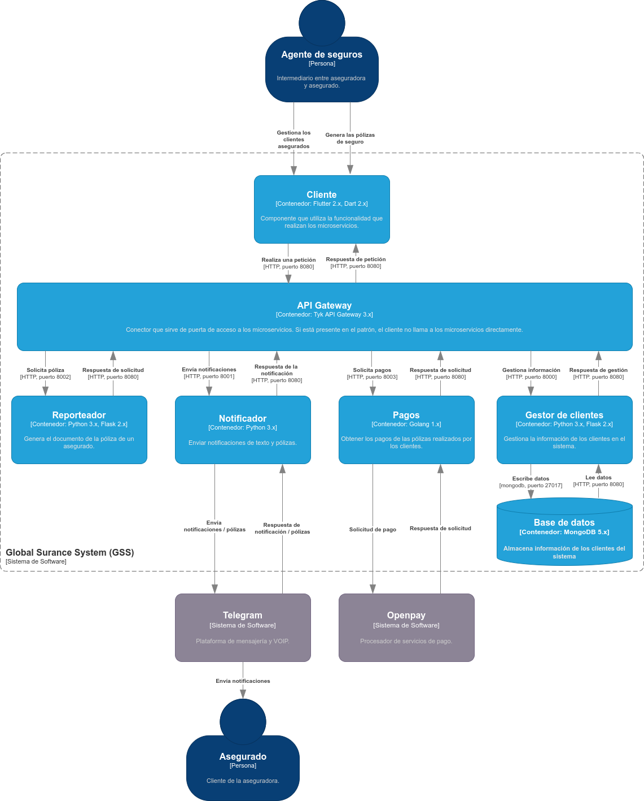
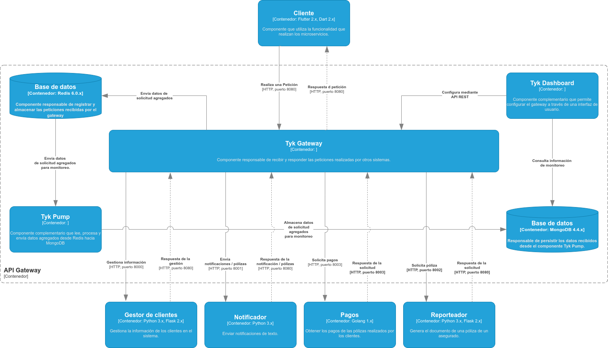
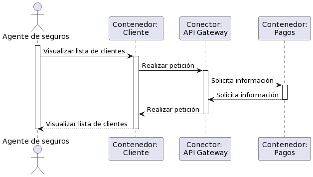
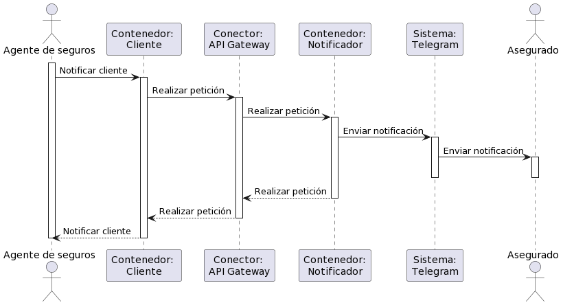
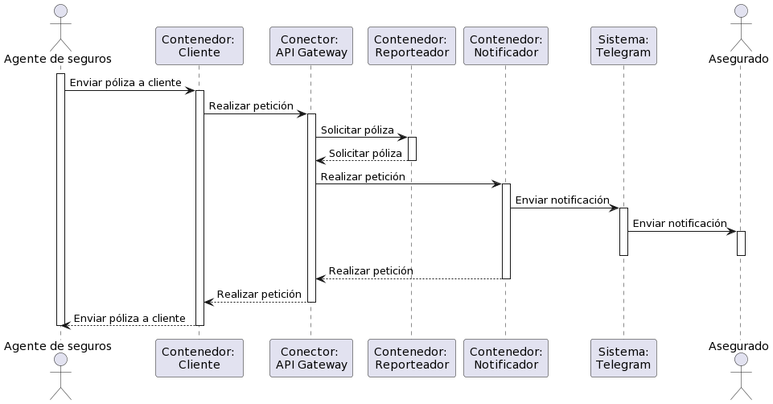

# Actualización de los diagramas para reflejar la nueva versión del sistema

## Diagrama de contexto

## Vista de módulos

## Vista de módulos con elementos de Tyk

## Requerimientos de usuario

a) Como agente de seguros necesito obtener los pagos de pólizas realizados por los clientes, de forma que pueda dar seguimiento al periodo de cobertura del seguro.

b)Como agente de seguros necesito notificar al cliente asegurado cuando se valide el pago de su póliza de tal forma que el cliente pueda saber cuando se ha renovado su póliza.

c) Como agente de seguros necesito enviar una póliza de seguro a un cliente por un servicio de mensajería.

### Vista dinámica del requerimiento de usuario a)

### Vista dinámica del requerimiento de usuario b)

### Vista dinámica del requerimiento de usuario c)

